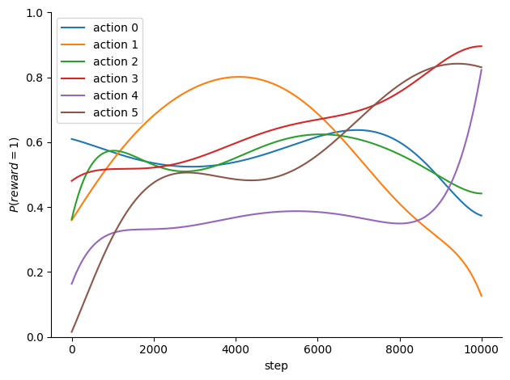
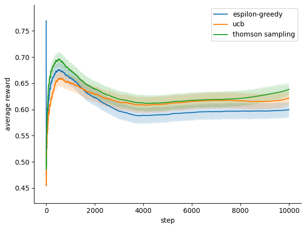

# Jax-bandits

## About <a name = "about"></a>

This repository contains implementations of three classical multi-armed bandit algorithms: epsilon-greedy, UCB and Thomson sampling with Beta prior, as well as a simple setup to benchmark those algorithms on synthetic random data. The implementation is in Jax and JIT compilable.

The repository purpose is to provide examples on how to use Jax for stateful systems such as multi-armed bandits algorithms while respecting its functional design philosophy as well as how using `jit` and chaining `vmap` operators to vectorize computations can dramatically accelerate the runtime. It also serves as an educational project for me to learn some core features of Jax.

`data.py` contains utility methods to generate random binary rewards:
- stationary rewards, where a vector of probability of size `num_action` is sampled from the uniform distribution and a 2D array of rewards is sampled from the Bernoulli distribution,
- bi-regime rewards, where two vectors of probabilities are sampled, then a 2D array of probability vectors of size `num_steps` is built by interpolating between the two probability vectors. Linear, cosine and exponential interpolation schemes are available.
- multi-regime rewards, where `num_regime` probability vectors are sampled and are used as control points for Bézier interpolation.

The last two allow to simulate non-stationary (but smooth) environments, where the true rewards distribution varies over time.



`simulate.py` contains utility methods to run policies over `num_steps` for `num_iter` iterations (as some policies can be stochastic, such as Thomson sampling) and over `num_dataset` random synthetic true rewards distributions, in order to have a more robust estimation of the policies performance.

The base `simulate` method is vectorized to run multiple iterations on multiple true rewards distributions using Jax built-in `vmap` operator.



(almost) all methods are compiled to XLA machine code to really leverage Jax power and avoid Python overhead.

## Getting Started <a name = "getting_started"></a>

Clone the repository locally and install the dependencies listed in the `pyproject.toml` file.

If you have `uv` you can simply run `uv sync` while in the project's directory to create the environment with the required dependencies.

## Usage <a name = "usage"></a>

```python
import jax
import jax.numpy as jnp

from src.bandits.data import multiregime_rewards
from src.bandits.environment import Policy, benchmark_policies
from src.bandits.policies import epsilon_greedy, thomson_sampling, ucb
from src.bandits.utils import plot_rewards


key = jax.random.key(1234)
key_r, key_s = jax.random.split(key, 2)

num_actions = 6
num_steps = 10_000
num_iter = 100
num_datasets = 10

greedy_init_state = epsilon_greedy.EpsilonGreedyState(
    epsilon=0.1,
    epsilon_decay=1.0,
    values=jnp.zeros(num_actions),
    counts=jnp.zeros(num_actions),
)

ucb_init_state = ucb.UCBState(
    c=1.0,
    steps=0.0,
    values=jnp.zeros(num_actions),
    counts=jnp.zeros(num_actions),
)

ts_init_state = thomson_sampling.ThomsonSamplingState(
    alphas=jnp.ones(num_actions),
    betas=jnp.ones(num_actions),
    discount=0.999,
)

policies = [
    Policy(epsilon_greedy.select_action, epsilon_greedy.update_state, greedy_init_state),
    Policy(ucb.select_action, ucb.update_state, ucb_init_state),
    Policy(thomson_sampling.select_action, thomson_sampling.update_state, ts_init_state),
]

final_states, rewards = benchmark_policies(
    key,
    policies,
    num_actions,
    num_steps,
    num_iter,
    num_datasets,
    dataset_generator_fn=multiregime_rewards,
    dataset_generator_fn_args=(10,),
)

plot_rewards(rewards, ["espilon-greedy", "ucb", "thomson sampling"])
```

Refer to `notebooks/example.ipynb` for more.
